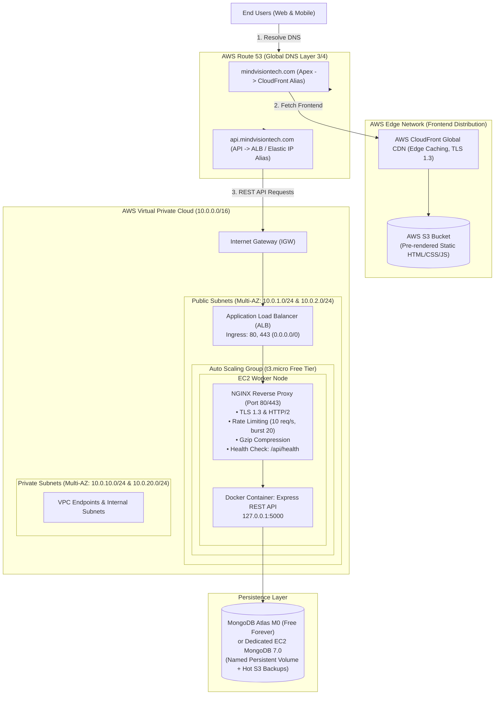

# MindVisionTech — Enterprise Production Platform & Infrastructure

[](https://nodejs.org/)
[](https://nextjs.org/)
[](https://www.docker.com/)
[](https://aws.amazon.com/)
[](https://vitest.dev/)
[](deploy/aws/nginx.conf)

MindVisionTech is an enterprise-grade web application platform providing industry-focused training, embedded systems, VLSI, and IoT engineering courses. The platform is architected for **high performance, zero downtime, cost efficiency, and automated scalability** on Amazon Web Services (AWS).

> 📘 **Looking for deep technical specifications, AWS architecture diagrams, or itemized service cost tables?**  
> Check out the complete [**System Architecture & Engineering Specifications**](SYSTEM_ARCHITECTURE.md).

---

## 1. System Architecture



---

## 2. Repository Structure

```text
mindvisiontech/
├── .github/
│   └── workflows/
│       └── deploy.yml            # CI/CD pipeline: Test -> S3/CloudFront -> EC2 Hot Reload
├── client/                       # Next.js 16 App Router Frontend
│   ├── app/                      # Dynamic and static page routes
│   ├── components/               # UI components (LeadForm, CourseCard, BlogFilterList)
│   ├── public/images/            # Self-hosted production assets (about, authors, blogs)
│   ├── tests/                    # Client Vitest unit & component test suites
│   ├── Dockerfile                # Multi-stage standalone Next.js container build
│   └── next.config.ts            # Dual-mode build config (standalone vs static export)
├── server/                       # Express.js REST API Backend
│   ├── config/                   # MongoDB connection pooling and environment loaders
│   ├── controllers/              # Business logic with field whitelisting (anti-mass assignment)
│   ├── middleware/               # Auth, input sanitization, and production error maskers
│   ├── models/                   # Mongoose schemas (Lead, Course, Branch)
│   ├── routes/                   # Validated Express routes
│   ├── tests/                    # Vitest unit and API integration test suites
│   ├── Dockerfile                # Production Alpine Node.js container build
│   └── server.js                 # Express server with graceful shutdown & trust-proxy
├── deploy/
│   └── aws/                      # Production AWS Infrastructure & Automation Toolkit
│       ├── backup-db.sh          # Hot MongoDB snapshot & S3 disaster recovery backup
│       ├── launch-template-config.json # AWS EC2 Launch Template configuration
│       ├── nginx.conf            # Hardened NGINX reverse proxy with TLS 1.3 & rate limits
│       ├── provision-asg.sh      # AWS CLI automated provisioner for ALB & Auto Scaling
│       ├── provision-vpc.sh      # AWS CLI provisioner for custom VPC, Subnets & IGW
│       ├── restore-db.sh         # 1-command MongoDB database restoration tool
│       ├── setup-backup-cron.sh  # Automated daily 02:00 AM backup cron scheduler
│       ├── setup-instance.sh     # Golden AMI creation & sysprep sanitization script
│       ├── update-prod.sh        # Zero-downtime hot-reload script with auto-rollback
│       └── user-data.sh          # Automated EC2 cloud-init bootstrap script
├── docker-compose.yml            # Local development compose (MongoDB 7.0 on port 27017)
├── docker-compose.prod.yml       # Production single-EC2 compose with named persistent volume
├── docker-compose.asg.yml        # Production stateless API compose for Auto Scaling nodes
├── ecosystem.config.js           # PM2 process manager configuration (cluster mode)
└── package.json                  # Workspace orchestration and test runner scripts
```

---

## 3. Local Development Setup

### Prerequisites
- [Node.js](https://nodejs.org/) v20 LTS or higher
- [Docker Engine](https://docs.docker.com/engine/install/) & Docker Compose plugin
- Git

### Quick Start
```bash
# 1. Clone the repository
git clone https://github.com/vasanthakumarj2004/mindvisiontech.git
cd mindvisiontech

# 2. Install dependencies across root, server, and client
npm install
npm run install:all

# 3. Start local MongoDB with Docker
docker compose up -d mongodb

# 4. Initialize environment variables
cp server/.env.example server/.env

# 5. Launch both server (port 5000) and client (port 3000) concurrently
npm run dev
```

### Running Test Suites
The project includes a comprehensive suite of unit and integration tests:
```bash
# Run all 26 server and client tests
npm test

# Run tests in watch mode
npm --prefix server run test:watch
npm --prefix client run test:watch
```

### Static Frontend Build Verification
```bash
npm run build:static
# Pre-renders all 21 static pages into client/out/
```

---

## 4. AWS Production Infrastructure Setup

### Cost Strategy for Startups:
- **Phase 1 (MVP Launch — ~$0.50/mo)**: Single `t3.micro` EC2 instance with Elastic IP running [`docker-compose.prod.yml`](docker-compose.prod.yml) + NGINX, with frontend on S3 + CloudFront. Free Tier covers compute, CDN, and storage; only Route 53 hosted zone costs $0.50/mo.
- **Phase 2 (Growth & Scale)**: Provision Application Load Balancer and Auto Scaling Group across multiple Availability Zones.

---

### Step 1: Provision the VPC Network
Execute the automated network provisioning script to create the VPC, Internet Gateway, 2 multi-AZ public subnets, 2 private subnets, and route tables:

```bash
cd deploy/aws
export AWS_REGION="ap-south-1"
./provision-vpc.sh
```

---

### Step 2: Deploy Static Frontend to S3 & CloudFront
```bash
# 1. Build the production static distribution
cd client
npm run build:static

# 2. Upload static assets to AWS S3
aws s3 mb s3://mindvisiontech-frontend-prod --region ap-south-1
aws s3 sync out/ s3://mindvisiontech-frontend-prod --delete

# 3. Invalidate CloudFront edge cache
aws cloudfront create-invalidation --distribution-id <DISTRIBUTION_ID> --paths "/*"
```

---

### Step 3: Provision Backend Compute

#### Option A: Single EC2 Instance with User Data (Simplest)
Launch an EC2 `t3.micro` Ubuntu 22.04 LTS instance, assign an Elastic IP, and paste the contents of [`deploy/aws/user-data.sh`](deploy/aws/user-data.sh) into the EC2 **User Data** field.

The user-data script automatically:
1. Allocates 2GB swap memory (protecting 1GB RAM instances from the OOM killer).
2. Installs Docker, Docker Compose, NGINX, and Certbot.
3. Generates placeholder SSL certificates to prevent bootstrap crashes.
4. Dynamically retrieves environment secrets from AWS Systems Manager Parameter Store.
5. Launches the production containers and enables systemd auto-restart.

#### Option B: Golden AMI with Auto Scaling Group (Fast Scaling)
To enable sub-45-second auto-scaling boot times:
```bash
# 1. Run the Golden AMI prep script on a base instance
sudo ./deploy/aws/setup-instance.sh

# 2. Capture the Golden AMI via AWS CLI
aws ec2 create-image \
  --instance-id <INSTANCE_ID> \
  --name "mindvisiontech-golden-ami-v1" \
  --no-reboot

# 3. Provision the Auto Scaling Group and Application Load Balancer
cd deploy/aws
export AMI_ID="<NEW_GOLDEN_AMI_ID>"
./provision-asg.sh
```

---

### Step 4: Configure Route 53 DNS Records
In your Route 53 Hosted Zone for `mindvisiontech.com`:

| Name | Type | Routing / Target | Description |
| :--- | :--- | :--- | :--- |
| `mindvisiontech.com` | `A` (Alias) | Alias to CloudFront Distribution | Fast global CDN edge delivery |
| `www.mindvisiontech.com` | `CNAME` | `mindvisiontech.com` | Canonical redirect |
| `api.mindvisiontech.com` | `A` (Alias) | Alias to ALB DNS (or Elastic IP) | REST API ingress |

---

## 5. Continuous Deployment (CI/CD)

The GitHub Actions workflow [`.github/workflows/deploy.yml`](.github/workflows/deploy.yml) automates testing, frontend deployment, and backend zero-downtime updates upon `git push origin main`.

### How Zero-Downtime Deployment Works:
1. **Automated Tests**: Vitest runs all unit and integration tests. If any test fails, deployment halts.
2. **Frontend Sync**: If files in `client/` changed, the pipeline builds the static export, uploads changes to S3, and clears CloudFront edge caches in under 45 seconds.
3. **Backend Hot-Reload**: If files in `server/` changed, GitHub Actions communicates with the EC2 instances via **AWS Systems Manager (SSM)** to run [`deploy/aws/update-prod.sh`](deploy/aws/update-prod.sh).

```bash
# To trigger a manual zero-downtime hot-reload directly on the EC2 server:
sudo /opt/mindvisiontech/deploy/aws/update-prod.sh
```

The script builds the new container image in the background, performs an **atomic container swap (< 50ms)**, verifies `http://127.0.0.1:5000/api/health`, and automatically rolls back to the previous Git commit if the healthcheck fails.

---

## 6. Database Persistence, Backups & Disaster Recovery

### Invariant Volume Naming
[`docker-compose.prod.yml`](docker-compose.prod.yml) binds MongoDB to an explicit named volume:
```yaml
volumes:
  mindvisiontech-mongodb-data:
    name: mindvisiontech_persistent_mongo_data
```
This ensures database state is never lost when restarting containers or switching directories.

### Automated Hot Backups
The backup script [`deploy/aws/backup-db.sh`](deploy/aws/backup-db.sh) performs non-blocking `mongodump` snapshots, compresses them, and uploads them to AWS S3:
```bash
# Take an immediate manual backup:
./deploy/aws/backup-db.sh
```

### 1-Command Database Restoration
Restore from the latest backup locally or directly from AWS S3:
```bash
# Restore latest local backup:
./deploy/aws/restore-db.sh

# Restore directly from offsite S3 bucket:
./deploy/aws/restore-db.sh --from-s3
```

### Schedule Daily Backups
Install a daily 02:00 AM UTC cron job:
```bash
sudo ./deploy/aws/setup-backup-cron.sh
```

---

## 7. Security & Hardening Highlights

- **Anti-DDoS & Rate Limiting**: NGINX throttles API traffic to `10 req/s` with a burst buffer of 20 (`limit_req_zone`).
- **Cryptographic Authentication**: Timing-safe comparison (`crypto.timingSafeEqual`) prevents side-channel timing attacks on API keys and JWT secrets.
- **Mass Assignment Defense**: Controllers strictly whitelist input fields (`name`, `email`, `phone`, `course`, `branch`, `message`).
- **XSS & Injection Protection**: HTML entity escaping and strict regex sanitization on all lead fields.
- **Information Leakage Prevention**: Production error handler masks database errors, stack traces, and internal IDs from 500 responses.
- **Memory & Swap Shielding**: 2GB swap partition and capped MongoDB WiredTiger cache (`--wiredTigerCacheSizeGB 0.25`) prevent out-of-memory container crashes on Free Tier instances.

---

## 8. DevOps Automation Scripts Reference

| Script | Location | Purpose |
| :--- | :--- | :--- |
| `provision-vpc.sh` | [`deploy/aws/provision-vpc.sh`](deploy/aws/provision-vpc.sh) | Creates VPC, Subnets, Internet Gateway, and Route Tables |
| `provision-asg.sh` | [`deploy/aws/provision-asg.sh`](deploy/aws/provision-asg.sh) | Creates Security Groups, Target Group, ALB, and Auto Scaling Group |
| `setup-instance.sh` | [`deploy/aws/setup-instance.sh`](deploy/aws/setup-instance.sh) | Pre-bakes Golden AMI, configures systemd, and sanitizes instance |
| `user-data.sh` | [`deploy/aws/user-data.sh`](deploy/aws/user-data.sh) | Cloud-init script for automated EC2 bootstrapping |
| `update-prod.sh` | [`deploy/aws/update-prod.sh`](deploy/aws/update-prod.sh) | Zero-downtime hot-reload script with healthcheck auto-rollback |
| `backup-db.sh` | [`deploy/aws/backup-db.sh`](deploy/aws/backup-db.sh) | Non-blocking database backup to compressed archive & AWS S3 |
| `restore-db.sh` | [`deploy/aws/restore-db.sh`](deploy/aws/restore-db.sh) | 1-command database restoration from local archive or S3 |
| `setup-backup-cron.sh`| [`deploy/aws/setup-backup-cron.sh`](deploy/aws/setup-backup-cron.sh)| Configures automated daily 02:00 AM UTC backup cron |
| `nginx.conf` | [`deploy/aws/nginx.conf`](deploy/aws/nginx.conf) | Production NGINX configuration (TLS 1.3, rate limits, HTTP/2) |

---

## 9. License

Proprietary © [MindVision Technologies](https://mindvisiontech.com). All rights reserved.