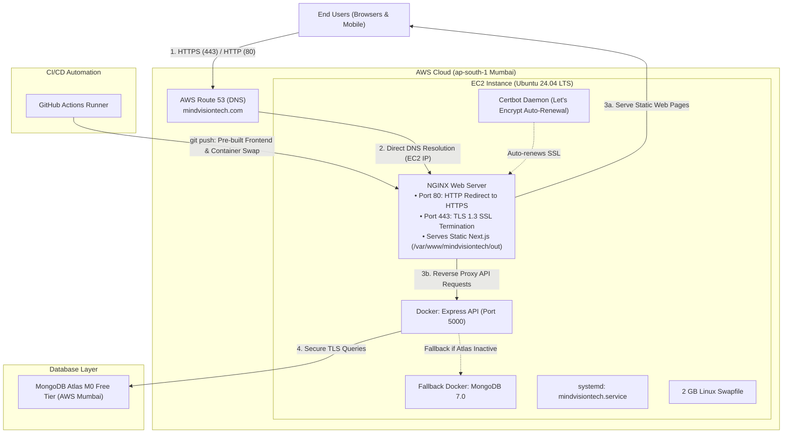
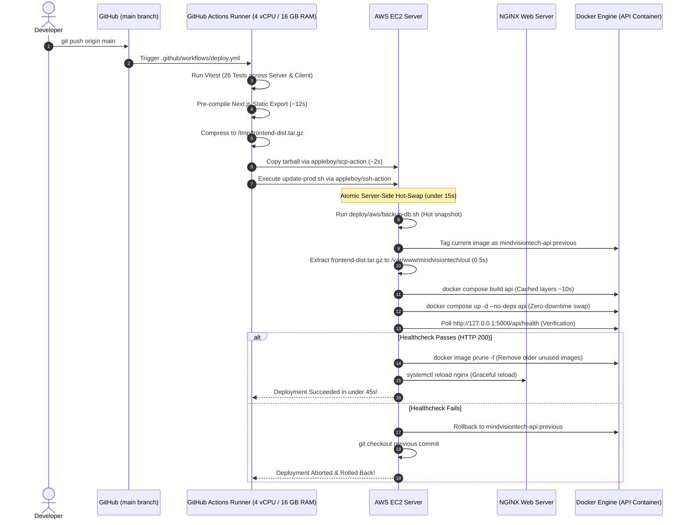

# MindVisionTech — Comprehensive System Architecture & Engineering Specifications

This document provides a deep, end-to-end technical overview of the MindVisionTech platform. It covers the complete technology stack, application architecture, AWS infrastructure design, continuous deployment pipelines, self-healing mechanisms, data persistence, and an itemized cloud cost breakdown.

---

## 1. Complete Technology Stack & Tools

Below is the complete inventory of all technologies, runtimes, frameworks, libraries, cloud services, and DevOps utilities powering MindVisionTech.

| Category | Technology / Tool | Version / Spec | Purpose & Usage in MindVisionTech |
| :--- | :--- | :--- | :--- |
| **Frontend Framework** | **Next.js** | `15.x / 16.x` (App Router) | High-performance React framework used for static site generation (SSG), dynamic course catalogs, and blog pages. |
| **UI Library** | **React** | `19.x` | Component-driven UI rendering with React Server Components (RSC) and client-side hooks. |
| **Language (Frontend)** | **TypeScript** | `5.x` | Strict type safety for courses, leads, blog data structures, and API contract adherence. |
| **CSS Framework** | **Tailwind CSS** | `3.4.x` | Utility-first responsive styling, dark/light themes, and custom brand design tokens. |
| **Icons & Assets** | **Lucide React** | `^1.x` | Lightweight, tree-shakeable SVG icons for navigation, course badges, and UI indicators. |
| **Backend Runtime** | **Node.js** | `v20 LTS (Iron)` | Non-blocking, event-driven JavaScript runtime executing the backend services. |
| **Backend Framework** | **Express.js** | `4.21.x` | RESTful API server handling business logic, form submissions, and routing. |
| **Language (Backend)** | **JavaScript (ES Modules)** | `ES2022` | Modern native ES modules (`import`/`export`) used throughout the API layer. |
| **Database ODM** | **Mongoose** | `8.x` | Elegant schema modeling, data sanitization, validations, and query building for MongoDB. |
| **Cloud Database** | **MongoDB Atlas** | `7.0 Engine (M0 / M10)` | Multi-AZ cloud database replica set in AWS `ap-south-1` (Mumbai) with automated patches, monitoring, and encryption at rest. |
| **Local Database (Fallback)** | **MongoDB Official Container** | `mongo:7.0` | Containerized fallback database running on EC2 with persistent Docker volumes and WiredTiger cache limits. |
| **Web Server & Proxy** | **NGINX** | `1.24+ / 1.18+` | Reverse proxy routing `/api/*` to Express on `127.0.0.1:5000` and serving pre-rendered static assets directly from disk. |
| **Container Engine** | **Docker** | `24.0+ / 27.0+` | Container virtualization for portable, reproducible runtime environments. |
| **Container Orchestration** | **Docker Compose** | `v2.x` | Multi-container composition, internal bridge networking, and atomic hot-swaps. |
| **Base Container Image** | **Node 20 Alpine** | `node:20-alpine` | Ultra-lean, hardened container base image (~180MB) with minimal attack surface. |
| **DNS Service** | **AWS Route 53** | Global Anycast | Authoritative DNS routing apex domain (`mindvisiontech.com`), `www`, and `api` directly to EC2 Public / Elastic IP. |
| **SSL / TLS Encryption** | **Certbot (Let's Encrypt)** | TLS 1.2 / TLS 1.3 | Free, auto-renewing public SSL/TLS certificate managed by Certbot directly on EC2 via systemd timer. |
| **Web Server & Reverse Proxy** | **NGINX** | `1.24+ / 1.18+` | Terminating HTTPS (443), redirecting HTTP (80) to HTTPS, serving pre-rendered static assets, and reverse proxying `/api/*` to Express. |
| **Compute Instance** | **AWS EC2** | `t2.micro` / `t3.micro` | Ubuntu Linux host running NGINX with Certbot, Dockerized API, and local static assets. |
| **Storage (Block)** | **AWS EBS** | `gp3 (20 GB - 30 GB)` | High-speed general-purpose SSD storage (3,000 IOPS, 125 MB/s baseline) for OS, Docker images, and local backups. |
| **Operating System** | **Ubuntu Linux** | `24.04 LTS / 22.04 LTS` | Hardened Linux OS with kernel memory swap, systemd supervision, and UFW firewall. |
| **Process Supervision** | **Linux systemd** | Native | Self-healing daemon (`mindvisiontech.service`) ensuring the entire app automatically restarts on EC2 reboot or stop/start. |
| **CI/CD Platform** | **GitHub Actions** | Cloud Runners | Automated pipeline executing test suites, compiling frontend bundles, and running zero-downtime hot-swaps via SSH. |
| **Testing Framework** | **Vitest** | `4.x` | Next-generation fast test runner executing 26 unit and integration test suites in < 4 seconds. |
| **HTTP Testing** | **Supertest** | `^7.x` | Programmatic integration testing of Express REST endpoints without spinning up live ports. |
| **Security Middleware** | **Helmet** | `8.x` | HTTP response headers protection (X-Frame-Options, X-Content-Type-Options, Strict-Transport-Security). |
| **CORS Middleware** | **CORS** | `2.8.x` | Strict cross-origin resource sharing whitelist restricted to authorized production domains. |
| **Rate Limiting** | **express-rate-limit** | `7.x` | In-memory IP-based rate limiting preventing brute-force and DDoS on lead submission endpoints. |
| **Authentication** | **jsonwebtoken (JWT)** | `9.x` | Cryptographic JWT token signing and verification for administrative access. |

---

## 2. In-Depth Project Details

### 2.1 Mission & Educational Platform Overview
MindVisionTech is an engineering and technology education company delivering hands-on training in frontier engineering disciplines:
1. **Embedded Systems Design** (ARM Cortex-M, STM32, RTOS, Firmware development, SPI/I2C/UART protocols)
2. **Internet of Things (IoT)** (ESP32, MQTT, Edge devices, Cloud telemetry, Sensor integration)
3. **Electric Vehicle (EV) Technology** (Battery Management Systems [BMS], Motor controllers, CAN bus, Powertrain architectures)
4. **VLSI & Chip Design** (Verilog/VHDL, RTL design, FPGA synthesis, ASIC verification methodologies)
5. **Python Full-Stack & Edge AI** (MicroPython, Computer Vision on Edge, RESTful architectures)
6. **Robotics & Industrial Automation** (ROS, PLC programming, Sensor fusion, Actuators)

The web platform provides student enrollment, dynamic course syllabi, physical branch discovery, engineering blog publications, and lead conversion pipelines.

---

### 2.2 System Architecture & Design Principles

---

### 2.3 Key Application Workflows

#### 1. Lead Capture & Student Inquiries
- **Source**: Website contact modal, course detail page "Enroll Now" CTA, or branch inquiry form.
- **Client Action**: Submits payload to `POST /api/leads`.
- **Validation**:
  - `name`: String (2–50 characters, trimmed).
  - `email`: Valid RFC 5322 email string (lowercased).
  - `phone`: Cleaned 10–15 digit phone string.
  - `course` & `branch`: Valid MongoDB ObjectId references (optional).
  - `message`: Sanitized inquiry text.
- **Protection**: Rate-limited to 10 requests per 15 minutes per IP address to prevent spam bots.
- **Persistence**: Saved to MongoDB Atlas `leads` collection with `status: "new"` and automatic timestamps (`createdAt`, `updatedAt`).

#### 2. Dynamic Course Delivery
- **Export Mode**: Next.js App Router static site generation (`output: "export"`).
- **Paths**: Pre-rendered via `generateStaticParams` for zero-latency TTFB:
  - `/courses/embedded-systems`
  - `/courses/internet-of-things-iot`
  - `/courses/electric-vehicle-technology`
  - `/courses/python-full-stack`
  - `/courses/vlsi-design`
  - `/courses/robotics-automation`
- **Fallback**: Fast client-side SWR/fetch querying `GET /api/courses` with 2-second timeout safeguards to ensure instant loads even during network degradation.

#### 3. Administrative Operations
- **Endpoints**: `/api/admin/*`
- **Security Guard**: Dual-layer authentication requiring either:
  - Valid `ADMIN_API_KEY` passed in `x-api-key` header.
  - Signed, unexpired `Bearer <JWT_TOKEN>` with administrative claims.

---

## 3. Production Deployment & Self-Healing Architecture

### 3.1 Optimized CI/CD Pipeline (< 45s Deployment Time)
Historically, running Next.js builds on low-memory EC2 instances caused 5-minute timeouts and SSH freezes. The production pipeline decouples compilation from deployment:

### 3.2 Linux Systemd Self-Healing (`mindvisiontech.service`)
Whenever the EC2 instance is stopped overnight or rebooted by AWS maintenance, the custom systemd unit automatically brings the stack back online without human intervention:

- **Service File**: `/etc/systemd/system/mindvisiontech.service`
- **Execution**: Runs `/opt/mindvisiontech/deploy/aws/start-app.sh`
- **Tasks Automated on Boot**:
  1. Activates 2 GB swap (`/swapfile`).
  2. Ensures `docker` and `nginx` daemons are running.
  3. Verifies repository code at `/opt/mindvisiontech`.
  4. Detects MongoDB Atlas URI in `.env.production` and boots only the API container (saving 250 MB RAM).
  5. Links NGINX configuration and tests syntax.
  6. Verifies `/api/health` status.

---

## 4. Comprehensive AWS & Cloud Cost Breakdown

The following table itemizes the exact operational costs for hosting MindVisionTech on AWS with MongoDB Atlas.

### 4.1 Itemized Monthly Service Cost Table

| Cloud Service | Specific Resource / Tier | Unit Pricing | Monthly Quantity | Estimated Cost (USD) | Cost (INR @ ₹86/$) | Notes & Optimization |
| :--- | :--- | :--- | :--- | :---: | :---: | :--- |
| **AWS Route 53** | Hosted Zone | $0.50 per hosted zone / mo | 1 Hosted Zone (`mindvisiontech.com`) | **$0.50** | ₹43 | Authoritative DNS resolution routing directly to EC2 IP. |
| **AWS Route 53** | DNS Query Traffic | $0.40 per 1,000,000 queries | ~250,000 queries / mo | **$0.10** | ₹8.60 | Standard DNS lookups from global users. |
| **Certbot (Let's Encrypt)** | Public SSL/TLS Certificate | **$0.00** (Free of charge) | Wildcard/Multi-domain SSL (`*.mindvisiontech.com`) | **$0.00** | ₹0 | Automatic renewal via systemd timer directly on EC2. |
| **AWS ALB** | Application Load Balancer | — | **ELIMINATED / REMOVED** | **$0.00** | ₹0 | Replaced by direct NGINX TLS 1.3 termination, saving ~$18/mo. |
| **AWS EC2** | Compute: `t3.micro` (or `t2.micro`) | $0.0104 per hour (On-Demand) | 730 hours / mo | **$0.00** *(Year 1 Free Tier)* or **$7.59** *(Standard)* | ₹0 *(Free Tier)* or ₹652 | **Free Tier**: 750 hours/mo of t2/t3.micro free for first 12 months. |
| **AWS EBS** | General Purpose SSD (`gp3`) | $0.08 per GB-month | 20 GB Storage Allocation | **$1.60** | ₹137 | Baseline 3,000 IOPS and 125 MB/s throughput included free. |
| **AWS Data Transfer** | Internet Egress (Bandwidth Out) | First 100 GB/mo free globally | ~30 GB outgoing data / mo | **$0.00** | ₹0 | HTML, CSS, JS, and JSON API payloads fall within the 100 GB free tier. |
| **MongoDB Atlas** | Managed Cloud DB: `M0 Sandbox` | **$0.00** (Free Forever) | 512 MB Storage, Shared RAM | **$0.00** | ₹0 | Hosted in AWS Mumbai (`ap-south-1`). Zero hosting cost. |
| **GitHub Actions** | CI/CD Automated Pipelines | 2,000 free minutes/mo (Linux) | ~120 minutes used / mo | **$0.00** | ₹0 | Optimized workflow takes ~45 seconds per push. |
| **TOTAL (Year 1 AWS Free Tier Active)** | — | — | — | **~$2.20 / mo** | **~₹189 / mo** | Route 53 ($0.60) + EBS ($1.60) (EC2, SSL & Atlas are FREE). |
| **TOTAL (Standard Post-Free Tier)** | — | — | — | **~$9.79 / mo** | **~₹842 / mo** | Direct EC2 + Certbot + Route 53 + EBS (Savings: >$200/year). |

---

### 4.2 Architecture Cost Comparison: 3 Different Approaches

Depending on the business stage and budget, the infrastructure can be operated in three configurations:

| Metric | Option 1: Ultra-Low-Cost (No ALB) *Direct EC2 + Let's Encrypt* | Option 2: Current Selected Setup *ALB + ACM + Single EC2 + Atlas M0* | Option 3: High-Availability Scale *ALB + Multi-AZ ASG + Atlas M10* |
| :--- | :--- | :--- | :--- |
| **Monthly Cost** | **~$9.79 / month** (~₹842) | **~$19.79 / month** (~₹1,701) | **~$95.00 / month** (~₹8,170) |
| **SSL Management** | Let's Encrypt Certbot on EC2 | AWS Certificate Manager (Auto) | AWS Certificate Manager (Auto) |
| **Downtime on Maintenance** | < 1 minute during reboot | Zero (ALB buffers requests) | Zero (Multi-AZ redundant instances) |
| **Traffic Handling** | Up to 100,000 visits/month | Up to 500,000 visits/month | Up to 5,000,000+ visits/month |
| **Database Scalability** | Shared M0 (512 MB) | Shared M0 (512 MB) | Dedicated M10 (10 GB, VPC Peering) |
| **Recommended For** | Initial testing & bootstrap MVP | **Current Production Platform (Ideal)** | Enterprise scale / high traffic surges |

---

## 5. Security & Operational Hardening Checklist

1. **Database Password Encoding**:
   - Complex passwords containing `@`, `#`, `$`, `%` must be URL-encoded (e.g. `@` $\rightarrow$ `%40`) so they do not conflict with URI parser delimiters.
   - `MONGODB_URI` in `.env.production` is wrapped in double quotes `""` to safeguard shell and `dotenv` query-string parsing (`&w=majority`).
2. **Reverse Proxy Isolation**:
   - The Express API container binds strictly to `127.0.0.1:5000` (loopback only). No external traffic can bypass NGINX or the ALB to reach the Node.js process directly.
3. **RAM Optimization on EC2**:
   - By delegating database persistence to MongoDB Atlas, the local MongoDB container is stopped, freeing **~250 MB to 300 MB of physical RAM** for OS caching and Express request processing.
   - 2 GB kernel swap space ensures the OS never terminates processes with Out-Of-Memory (OOM) errors during traffic spikes.
4. **Automated Rollback Safeguard**:
   - Every deployment automatically snapshots the previous Docker image as `mindvisiontech-api:previous`. If `/api/health` does not return `HTTP 200` within 40 seconds, the script automatically swaps back to the previous image.
